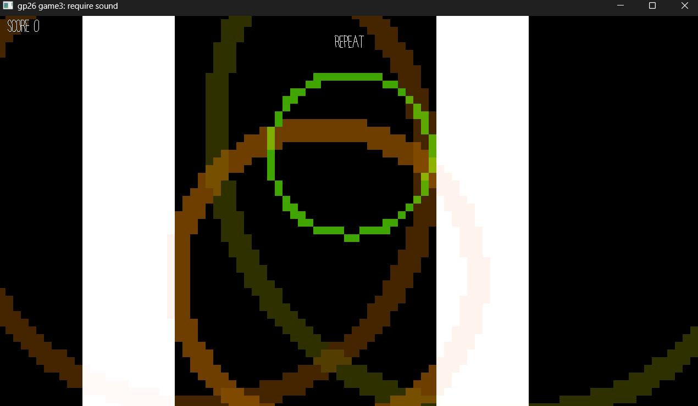

# (Press and Recreate)

Author: (Tao Jin / tjin2)

Design: (The game maps the screen space to 10 notes and mimics a guitar sound. Pressing the space key creates a pixel ripple in screen with notes that corresponds to the region that the center of the ripple is at.)

Screen Shot:

How To Play:

(Try to mimic the pattern of notes that appear in every 8 beats. Each successful reproduce gives one point.)

This game was built with [NEST](NEST.md).
